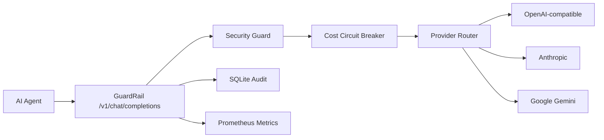

# Architecture

GuardRail is a reverse proxy for AI Agent traffic. Agents keep using the OpenAI-compatible Chat Completions shape and point `base_url` to GuardRail.

## Request Flow

1. Decode the OpenAI-compatible chat request.
2. Inspect prompt text for prompt injection and PII findings.
3. Redact PII when configured.
4. Estimate prompt and completion tokens before sending upstream.
5. Reject requests that would exceed per-request or daily budget.
6. Route to matching providers by model, failing over on `429` and `5xx`.
7. Copy provider responses back to the caller.
8. Record cost, metrics, and audit events.

## Provider Adapters

- `openai` and `openai-compatible` forward the Chat Completions body transparently.
- `anthropic` maps Chat Completions to Messages API for non-streaming calls.
- `google` maps Chat Completions to Gemini `generateContent` for non-streaming calls.

Streaming pass-through is enabled for OpenAI-compatible providers in v0.1.
