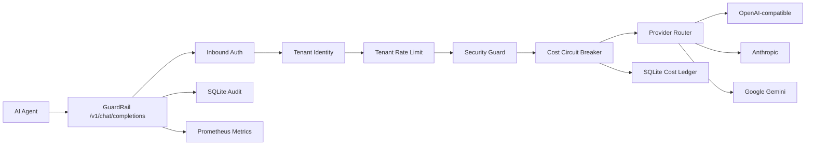

# Architecture

GuardRail is a reverse proxy for AI Agent traffic. Agents keep using the OpenAI-compatible Chat Completions shape and point `base_url` to GuardRail.

## Request Flow

1. Require a valid proxy API key or OIDC token for chat requests when auth is enabled.
2. Resolve tenant identity from the API key mapping or OIDC tenant claim.
3. Apply the tenant rate limit before reading the request body.
4. Decode the OpenAI-compatible chat request.
5. Inspect prompt text for prompt injection and PII findings.
6. Redact PII when configured.
7. Estimate prompt and completion tokens before sending upstream.
8. Reject requests that would exceed tenant per-request or daily budget using persisted daily spend.
9. Route to matching providers by model, failing over on `429` and `5xx`.
10. Copy provider responses back to the caller.
11. Record tenant cost, metrics, and audit events.

## Provider Adapters

- `openai` and `openai-compatible` forward the Chat Completions body transparently.
- `anthropic` maps Chat Completions to Messages API for non-streaming calls.
- `google` maps Chat Completions to Gemini `generateContent` for non-streaming calls.

Streaming pass-through is enabled for OpenAI-compatible providers in v0.1.
