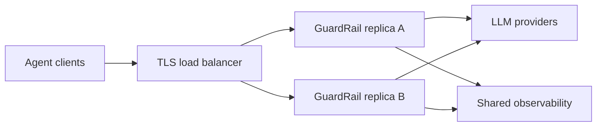

# HA Deployment

GuardRail can run behind a standard L7 load balancer because provider routing, prompt inspection, PII redaction, and OIDC verification are stateless per request. State-sensitive controls need explicit deployment choices.

## Recommended Topology



Use:

- TLS termination and request buffering at the load balancer.
- At least two GuardRail replicas in separate failure domains.
- Identical `configs/guardrail.yaml` delivered through your secret/config system.
- A shared metrics backend scraping every replica.
- Readiness checks against `/healthz`.

## State Boundaries

GuardRail currently uses SQLite for audit and tenant cost state. SQLite is excellent for a single active writer, but it is not a distributed database.

For strict global tenant budgets in HA:

- Run active/passive GuardRail with one active writer and fast failover, or
- Put GuardRail behind an external global budget service before allowing multiple active writers, or
- Keep one active budget-enforcing replica per tenant shard.

For strict global rate limits in HA:

- Use an edge limiter such as Envoy, NGINX, Cloudflare, or your API gateway with a shared backing store, or
- Partition tenants deterministically to replicas.

The built-in tenant rate limiter is instance-local. It protects each replica, but it does not provide cluster-wide request accounting.

## Rollout Checklist

1. Set `auth.enabled: true`.
2. Use tenant-scoped proxy keys or OIDC `tenant_claim`.
3. Configure tenant budgets and tenant rate limits.
4. Configure `/metrics` scraping for every replica.
5. Keep `write_timeout: 0s` if you proxy streaming responses.
6. Use versioned schema migrations before first serving traffic.
7. Test failover by stopping the active replica during a non-streaming request and a streaming request.

## Kubernetes Notes

Recommended probes:

```yaml
readinessProbe:
  httpGet:
    path: /healthz
    port: 8080
  periodSeconds: 5
  failureThreshold: 2
livenessProbe:
  httpGet:
    path: /healthz
    port: 8080
  periodSeconds: 10
  failureThreshold: 3
```

Recommended rolling update:

```yaml
strategy:
  type: RollingUpdate
  rollingUpdate:
    maxUnavailable: 0
    maxSurge: 1
```

For the current SQLite-backed release, prefer active/passive or tenant sharding when budget enforcement must be globally exact.
